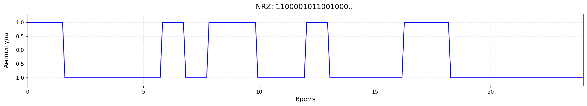
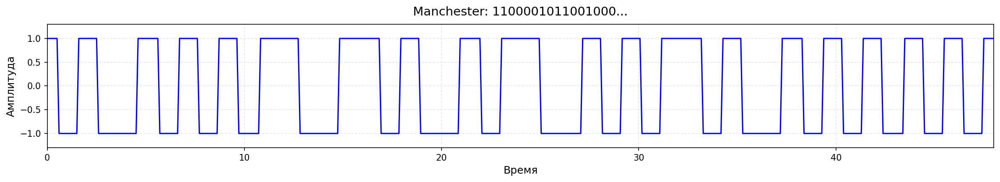
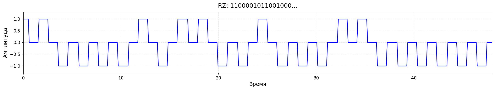
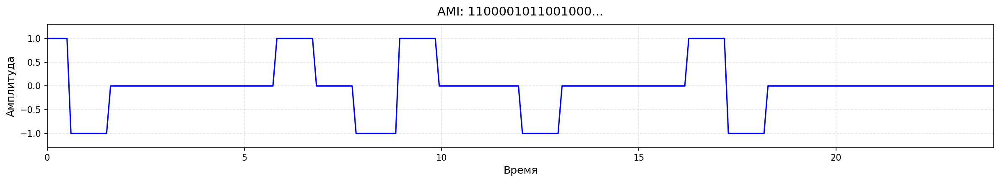
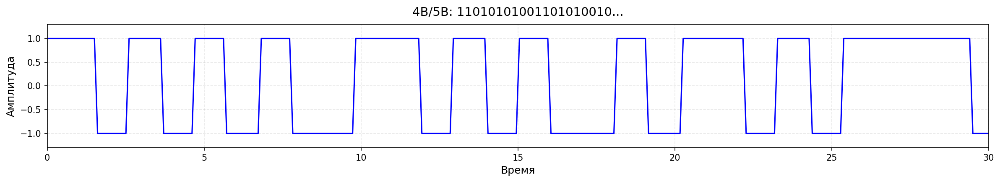
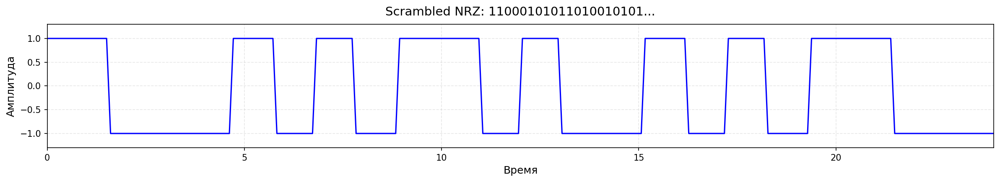

# Отчёт по лабораторной работе

**Дисциплина:** Компьютерные сети
**Тема:** Исследование методов кодирования в цифровых сетях

## 1. Цель работы

Исследование методов физического и логического кодирования сигналов в цифровых сетях, 
анализ их характеристик и сравнение эффективности.

## 2. Этап 1: Формирование сообщения

### Исходные данные

- **Hex:** 0xC2C8C0
- **Байты:** C2 C8 C0
- **Биты:** 11000010 11001000 11000000
- **Длина:** 24 бит (3 байт)

## 3. Этап 2: Физическое кодирование

### 3.1 NRZ

**Описание:** Метод NRZ (Non-Return-to-Zero) - уровень сигнала не меняется в течение бита.
1 → высокий уровень, 0 → низкий уровень.

**Характеристики:**
- Верхняя граница частоты: **50.00 МГц**
- Нижняя граница частоты: **8.33 МГц**
- Требуемая полоса пропускания: **50.00 МГц**
- Уровней сигнала: 2
- Постоянная составляющая (DC): Да
- Макс. серия нулей: 6

### 3.2 Manchester

**Описание:** Манчестерское кодирование - переход в середине каждого бита.
0 → переход LOW→HIGH, 1 → переход HIGH→LOW.

**Характеристики:**
- Верхняя граница частоты: **100.00 МГц**
- Нижняя граница частоты: **50.00 МГц**
- Требуемая полоса пропускания: **100.00 МГц**
- Уровней сигнала: 2
- Постоянная составляющая (DC): Нет

### 3.3 RZ

**Описание:** Метод RZ (Return-to-Zero) - сигнал возвращается к нулю во второй половине бита.

**Характеристики:**
- Верхняя граница частоты: **100.00 МГц**
- Нижняя граница частоты: **25.00 МГц**
- Требуемая полоса пропускания: **100.00 МГц**
- Уровней сигнала: 3
- Постоянная составляющая (DC): Нет

### 3.4 AMI

**Описание:** Биполярное кодирование с чередованием - единицы чередуют полярность, нули - нулевой уровень.

**Характеристики:**
- Верхняя граница частоты: **50.00 МГц**
- Нижняя граница частоты: **7.14 МГц**
- Требуемая полоса пропускания: **50.00 МГц**
- Уровней сигнала: 3
- Постоянная составляющая (DC): Нет
- Макс. серия нулей: 6

## 4. Этап 3: Логическое (избыточное) кодирование

### 4B/5B

**Описание:** Метод 4B/5B заменяет каждые 4 бита на 5-битный символ.
Цель - устранить длинные последовательности нулей и обеспечить синхронизацию.

**Исходное сообщение:** 110000101100100011000000 (24 бит)
**Закодированное сообщение:** 110101010011010100101101011110 (30 бит)
**Избыточность:** 20.0%

**Характеристики:**
- Скорость в канале: **125.0 Мбит/с**
- Верхняя граница частоты: **62.50 МГц**
- Нижняя граница частоты: **15.62 МГц**
- Требуемая полоса пропускания: **62.50 МГц**
- Уровней сигнала: 2
- Макс. серия нулей: 3

## 5. Этап 4: Скремблирование

### Скремблирование (полином 7-го порядка)

**Описание:** Скремблирование с полиномом B_i = A_i ⊕ B_{i-5} ⊕ B_{i-7}.
Цель - устранение постоянной составляющей и длинных последовательностей нулей.

**Исходное сообщение:** 110000101100100011000000 (24 бит)
**Скремблированное сообщение:** 110001010110100101011000 (24 бит)
**Макс. серия нулей до скремблирования:** 6
**Макс. серия нулей после скремблирования:** 3

**Характеристики:**
- Верхняя граница частоты: **50.00 МГц**
- Нижняя граница частоты: **16.67 МГц**
- Требуемая полоса пропускания: **50.00 МГц**
- Уровней сигнала: 2

## 6. Сводная таблица характеристик

| Метод | Полоса (МГц) | f_в (МГц) | f_н (МГц) | Уровни | DC |
|-------|-------------|-----------|-----------|--------|-----|
| NRZ | 50.0 | 50.0 | 8.3 | 2 | Да |
| Manchester (IEEE) | 100.0 | 100.0 | 50.0 | 2 | Нет |
| RZ | 100.0 | 100.0 | 25.0 | 3 | Нет |
| AMI | 50.0 | 50.0 | 7.1 | 3 | Нет |
| 4B/5B+NRZ | 62.5 | 62.5 | 15.6 | 2 | Нет |
| Scrambled NRZ (polynomial order 7) | 50.0 | 50.0 | 16.7 | 2 | Нет |

## 7. Выводы

### Анализ результатов

1. **Минимальную полосу пропускания** требуют методы NRZ, AMI и Scrambled NRZ: **50.0 МГц**. 
   Это связано с тем, что их максимальная частота равна C/2.

2. **Отсутствие постоянной составляющей (DC)** имеют 5 методов: 
Manchester (IEEE), RZ, AMI, 4B/5B+NRZ, Scrambled NRZ (polynomial order 7). 
Это важно для систем с трансформаторной развязкой.

3. **Сравнение NRZ и Manchester:**
   - Manchester требует полосу в 2 раза больше (100.0 vs 50.0 МГц)
   - Но Manchester обеспечивает гарантированную синхронизацию благодаря переходу в середине каждого бита

4. **Логическое кодирование (4B/5B):**
   - Увеличивает скорость до 125 Мбит/с (избыточность 20%)
   - Гарантирует не более 3 нулей подряд
   - Полоса увеличивается пропорционально: 62.5 МГц

5. **Скремблирование:**
   - Не увеличивает скорость (избыточность 0%)
   - Сокращает максимальную серию нулей с 6 до 3
   - Полоса остаётся как у NRZ: 50.0 МГц

### Рекомендации

- **Для высокоскоростных линий** (ограниченная полоса): NRZ, AMI или Scrambled NRZ
- **Для критически важной синхронизации**: Manchester (гарантированный переход)
- **Для баланса скорости и синхронизации**: 4B/5B + NRZ
